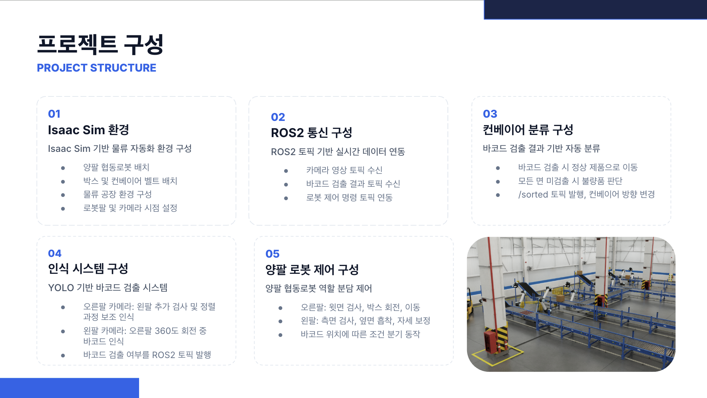
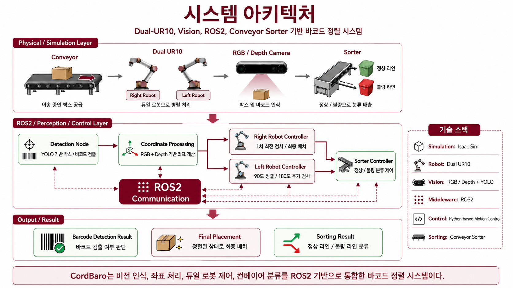
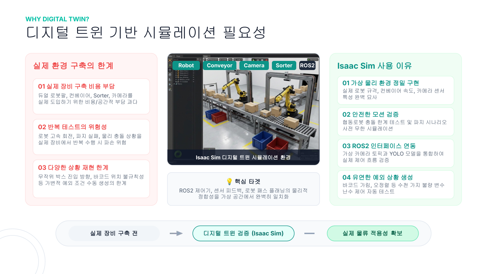
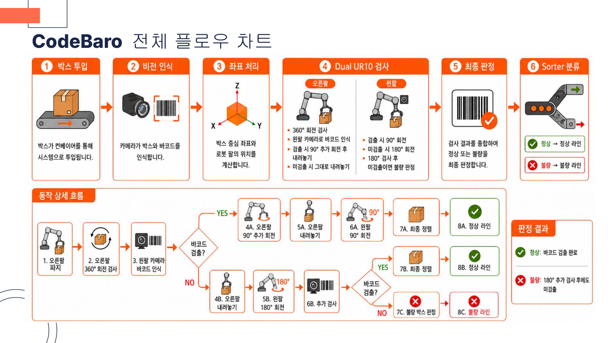
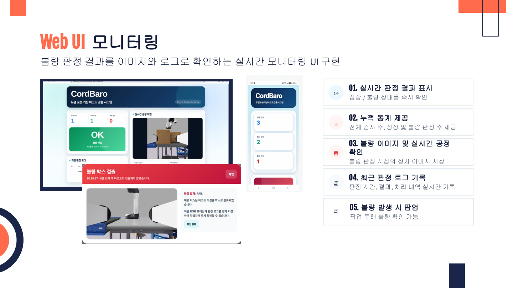

# 코드바로 (CodeBaro) — 스마트 바코드 정렬 시스템

> **팀 E-3** | 이재영 · 박수빈 · 신초희 · 정진목


---

## 👥 팀 구성

| 이름              | 역할                                                                                                                 |
| ----------------- | -------------------------------------------------------------------------------------------------------------------- |
| **이재영** (팀장) | 전체 시스템 플로우 설계, 기능 통합, 로봇팔 동작 시퀀스 개선, ROS2 공정 프로세스 설계, YOLO11 데이터셋 제작 및 학습   |
| **박수빈**        | Isaac Sim 환경 구성, 시뮬레이션 오류 수정, 로봇팔 제어                                                               |
| **신초희**        | Isaac Sim 환경 구성, 좌표계 변환, Depth 카메라 영상 처리, YOLO11 바코드 검출 및 결과 토픽 발행                       |
| **정진목**        | ROS2 통신 및 로봇 제어, 오른팔/왼팔 동작 시퀀스 구현, `/sorter_switch` 기반 컨베이어 분류 제어, Web UI 모니터링 개발 |

---

## 📋 목차

1. [프로젝트 개요](#-프로젝트-개요)
2. [팀 구성](#-팀-구성)
3. [시스템 설계](#️-시스템-설계)
4. [주요 기능](#-주요-기능)
5. [6면 검사 알고리즘](#-6면-검사-알고리즘)
6. [전체 플로우차트](#-전체-플로우차트)
7. [ROS2 토픽 목록](#-ros2-토픽-목록)
8. [개발 환경](#-개발-환경)
9. [사용 장비](#-사용-장비)
10. [의존성 설치](#-의존성-설치)
11. [실행 순서](#-실행-순서)
12. [Web UI 모니터링](#-web-ui-모니터링)
13. [프로젝트 구조](#-프로젝트-구조)

---

## 📦 프로젝트 개요

CodeBaro는 **NVIDIA Isaac Sim** 기반 디지털 트윈 환경에서 **Dual UR10 협동로봇**이 컨베이어 위 박스의 바코드를 자동 검사·정렬·분류하는 스마트 물류 자동화 시스템입니다.

박스 방향과 바코드 위치가 무작위인 실제 물류 환경 문제를 Isaac Sim 시뮬레이션으로 검증합니다.

- **오른팔** — 박스 상단 흡착 후 360° 회전하며 왼팔 카메라로 바코드 1차 탐색
- **왼팔** — 바코드 검출 결과에 따라 90° 정렬 또는 180° 뒤집기로 추가 검사
- **Sorter** — 최종 판정에 따라 정상 / 불량 라인을 자동 분기



---

## 🏗️ 시스템 설계(System Architecture)



### 시뮬레이션 환경 구성

| 구성 요소          | 역할                            |
| ------------------ | ------------------------------- |
| Main Conveyor      | 박스 투입 및 이송               |
| Right Robot (UR10) | 1차 360° 회전 검사 및 최종 배치 |
| Left Robot (UR10)  | 추가 검사 및 방향 정렬          |
| Inspection Area    | 박스 파지 및 집중 검사          |
| Sorting Area       | 최종 분류 및 정렬 배출          |

### 디지털 트윈을 사용하는 이유



실제 Dual UR10, Sorter, 카메라 장비 구축 비용·공간 부담 없이 Isaac Sim에서 물리 환경을 정밀 재현하고, 가상 카메라 토픽과 YOLO11 모델을 ROS2로 통합하여 실제 제어 흐름을 안전하게 검증합니다.

---

## ✨ 주요 기능

### 1. 6면 자동 바코드 검사

오른팔이 박스를 90° 단위로 최대 270°까지 회전하며 왼팔 카메라(`/rgb_L`)로 측면 바코드를 탐색합니다. 바코드 검출 즉시 90° 추가 회전으로 바코드 면을 정면에 정렬하고 내려놓습니다. 오른팔 회전 중 미검출 시 왼팔이 측면을 파지해 180° 뒤집기 후 오른팔 카메라(`/rgb_R`)로 재검사합니다.

### 2. YOLO11 기반 비전 인식 및 좌표 변환

YOLO11 모델(`best.pt`)로 박스(cls 0)와 바코드(cls 1)를 실시간 검출하고, RGB + Depth 영상에서 박스 중심 픽셀의 깊이값을 읽어 카메라 내부 파라미터와 TF로 월드 좌표를 계산합니다.

```
Wp = W·TM · M·TC · [Xc, Yc, Zc, 1]ᵀ
```

좌표 안정화(0.5초, ±5mm)와 바코드 연속 검출(0.5초)로 오검출을 차단합니다.

### 3. Dual Arm 협업 제어

| 단계      | Right Arm                  | Left Arm                  |
| --------- | -------------------------- | ------------------------- |
| 1차 검사  | 상단 흡착 → 360° 회전 탐색 | 왼팔 카메라로 바코드 인식 |
| 검출 성공 | 90° 추가 회전 후 배치      | 90° 회전 정렬             |
| 검출 실패 | 원위치 재배치              | 측면 파지 → 180° 뒤집기   |
| 최종      | 고정 목적지 이송           | Home 복귀                 |

### 4. Conveyor Sorter 자동 분기

- 최종 바코드 검출 → `/sorter_switch = 0` → **정상 라인** 직진
- 6면 검사 후 미검출 → `/sorter_switch = 1` → **불량 라인** 분기

### 5. Web UI 실시간 모니터링

Flask 서버에서 공정 영상을 MJPEG로 스트리밍하고, 누적 검사 통계·불량 이미지·판정 로그를 PC 및 모바일 화면에서 실시간 확인할 수 있습니다.

---

## 🔄 6면 검사 알고리즘 플로우 차트


### 공정 시나리오 4가지

| 시나리오 | 조건                                       | 동작                                  | Sorter     |
| -------- | ------------------------------------------ | ------------------------------------- | ---------- |
| **1**    | 오른팔 파지 전 상단 바코드 검출            | 회전 없이 목적지 직행                 | `0` (정상) |
| **2**    | 오른팔 회전 중 측면 바코드 검출            | 90° 추가 회전 → 왼팔 90° 정렬         | `0` (정상) |
| **3**    | 270°까지 미검출 → 왼팔 180° 후 재검출 성공 | 왼팔 180° 뒤집기 → 오른팔 재검사      | `0` (정상) |
| **4**    | 6면 전체 미검출                            | 왼팔 180° 뒤집기 → 오른팔 재검사 실패 | `1` (불량) |

---

## 📊 전체 공정 플로우차트



---

## 📡 ROS2 토픽 목록

### 입력 토픽 (Subscribed)

| 토픽                       | 타입                  | 발행 노드   | 설명                                 |
| -------------------------- | --------------------- | ----------- | ------------------------------------ |
| `/rgb_L`                   | `sensor_msgs/Image`   | Isaac Sim   | 왼팔 카메라 RGB 영상                 |
| `/depth_L`                 | `sensor_msgs/Image`   | Isaac Sim   | 왼팔 카메라 Depth 영상               |
| `/rgb_R`                   | `sensor_msgs/Image`   | Isaac Sim   | 오른팔 카메라 RGB 영상               |
| `/depth_R`                 | `sensor_msgs/Image`   | Isaac Sim   | 오른팔 카메라 Depth 영상             |
| `/box_coordinate_center_R` | `geometry_msgs/Point` | detection_R | 오른팔 기준 박스 중심 월드 좌표      |
| `/box_coordinate_center_L` | `geometry_msgs/Point` | detection_L | 왼팔 기준 박스 중심 월드 좌표        |
| `/barcode_exist_R`         | `std_msgs/Int32`      | detection_R | 오른팔 카메라 바코드 검출 여부 (0/1) |
| `/barcode_exist_L`         | `std_msgs/Int32`      | detection_L | 왼팔 카메라 바코드 검출 여부 (0/1)   |
| `/box_exist_R`             | `std_msgs/Int32`      | detection_R | 오른팔 시야 박스 존재 여부 (0/1)     |
| `/box_exist_L`             | `std_msgs/Int32`      | detection_L | 왼팔 시야 박스 존재 여부 (0/1)       |
| `/left_rotate_180`         | `std_msgs/Int32`      | stand_alone | 왼팔 180° 회전 완료 신호             |
| `/left_rotate_90`          | `std_msgs/Int32`      | stand_alone | 왼팔 90° 회전 완료 신호              |

### 출력 토픽 (Published)

| 토픽                 | 타입             | 수신 노드   | 설명                               |
| -------------------- | ---------------- | ----------- | ---------------------------------- |
| `/right_phase_done`  | `std_msgs/Int32` | stand_alone | 오른팔 1차 검사 완료 (data=1)      |
| `/right_extra_done`  | `std_msgs/Int32` | stand_alone | 오른팔 추가 90° 회전 완료 (data=1) |
| `/inspection_result` | `std_msgs/Int32` | stand_alone | 최종 검사 결과 (1=정상, 0=불량)    |
| `/sorter_switch`     | `std_msgs/Int32` | stand_alone | Sorter 분기 명령 (0=정상, 1=불량)  |
| `/left_scan_success` | `std_msgs/Int32` | stand_alone | 왼팔 검사 성공 신호                |
| `/left_scan_failed`  | `std_msgs/Int32` | stand_alone | 왼팔 검사 실패 신호                |

---

## 💻 개발 환경

| 항목           | 내용                                |
| -------------- | ----------------------------------- |
| OS             | Ubuntu 22.04 LTS (Jammy Jellyfish)  |
| Middleware     | **ROS 2 Humble** Hawksbill          |
| Simulator      | NVIDIA Isaac Sim 5.1                |
| Language       | Python 3.10                         |
| Vision         | **YOLO11** (Ultralytics)            |
| Motion Control | RMPflow                             |
| Gripper        | Isaac Sim SurfaceGripper (Dual pad) |
| Physics        | NVIDIA PhysX (USD)                  |
| Web Server     | Flask + MJPEG Streaming             |

---

## 🔧 사용 장비

| Component        | 사양                                         |
| ---------------- | -------------------------------------------- |
| PC               | Ubuntu 22.04 (Isaac Sim 실행용)              |
| Robot            | Dual UR10 협동로봇 (Right / Left 각 1대)     |
| Gripper          | Dual Surface Gripper (upper / lower 각 2개)  |
| Left Arm Camera  | RGB 640×640 + Depth — `/rgb_L`, `/depth_L`   |
| Right Arm Camera | RGB 640×640 + Depth — `/rgb_R`, `/depth_R`   |
| Conveyor         | Isaac Sim Conveyor Belt (ActionGraph)        |
| Sorter           | Isaac Sim Sorter (binary_switch ActionGraph) |

**카메라 내부 파라미터** (Left / Right 공통):

```
fx = fy = 317.0431
cx = 320.0,  cy = 320.0
해상도: 640 × 640
```

---

## 📦 의존성 설치

### 1. Python 라이브러리 설치

```bash
pip install ultralytics opencv-python numpy scipy flask
```

> YOLO11 모델은 `ultralytics` 패키지를 통해 로드합니다.

### 2. ROS2 Humble 패키지 설치

```bash
sudo apt update
sudo apt install -y \
  ros-humble-rclpy \
  ros-humble-std-msgs \
  ros-humble-geometry-msgs \
  ros-humble-sensor-msgs \
  ros-humble-tf2-msgs \
  ros-humble-launch \
  ros-humble-launch-ros
```

### 3. ROS2 워크스페이스 빌드

```bash
# 워크스페이스 생성 (이미 있으면 건너뜀)
mkdir -p ~/cobot3_ws/src
cd ~/cobot3_ws/src

# 패키지 복사 또는 클론
cp -r /path/to/DooSan_Robotics_IsaacSim_Project/src/cobot3 .

# 빌드
cd ~/cobot3_ws
colcon build --symlink-install --packages-select cobot3

# 환경 소싱
source install/setup.bash
```

### 4. 월드 USD 파일 다운로드

시뮬레이션 실행에 필요한 월드 USD 파일을 아래 링크에서 다운로드합니다.

> 📥 **[dual_suction_tf_barcode_LR.usd 다운로드 (Google Drive)](https://drive.google.com/file/d/1CPH7nSU33MukpHRFBqGt3lIBn7J7UJ78/view?usp=sharing)**

다운로드 후 원하는 경로에 저장하고, 실행 시 `--usd` 인자에 해당 경로를 지정합니다.

```bash
# 예시: Downloads 폴더에 저장한 경우
--usd /home/rokey/Downloads/dual_suction_tf_barcode_LR.usd
```

### 5. YOLO11 모델 경로 설정

`detection_L.py`, `detection_R.py` 파일 내 모델 경로를 실제 경로로 수정합니다:

```python
# detection_L.py / detection_R.py 수정
self.model = YOLO('/home/rokey/cobot3_ws/src/cobot3/cobot3/best.pt')
#                  ↑ 실제 best.pt 경로로 변경
```

### 6. Isaac Sim Extension 활성화

Isaac Sim 실행 후 다음 Extension이 활성화되어 있어야 합니다:

- `isaacsim.asset.gen.conveyor`
- `isaacsim.ros2.bridge`

---

## 🚀 실행 순서

> **주의:** Isaac Sim이 먼저 구동된 상태에서 ROS2 노드를 실행해야 합니다.

### 터미널 1 — Isaac Sim 시뮬레이션 실행

> USD 파일은 [의존성 설치 4번](#4-월드-usd-파일-다운로드)에서 다운로드한 경로를 `--usd` 인자에 지정합니다.

```bash
# Isaac Sim 설치 경로로 이동
cd /home/rokey/isaac-sim   # 실제 Isaac Sim 설치 경로로 변경

./python.sh /path/to/DooSan_Robotics_IsaacSim_Project/stand_alone.py \
    --usd /home/rokey/Downloads/dual_suction_tf_barcode_LR.usd \
    --spawn-interval 40.0
```
> rclpy 오류 시 아래 코드 터미널 복사
```unset PYTHONPATH
unset AMENT_PREFIX_PATH
unset COLCON_PREFIX_PATH
unset CMAKE_PREFIX_PATH
unset ROS_PACKAGE_PATH

export isaac_sim_package_path=/home/rokey/dev_ws/isaac_sim/isaacsim/_build/linux-x86_64/release
export ROS_DISTRO=humble
export RMW_IMPLEMENTATION=rmw_cyclonedds_cpp
export LD_LIBRARY_PATH=$isaac_sim_package_path/exts/isaacsim.ros2.bridge/humble/lib:$LD_LIBRARY_PATH

---

**실행 인자 설명:**

| 인자               | 기본값                           | 설명                                  |
| ------------------ | -------------------------------- | ------------------------------------- |
| `--usd`            | `dual_suction_tf_barcode_LR.usd` | 로봇·컨베이어 월드 USD 파일 절대 경로 |
| `--sorter-topic`   | `/sorter_switch`                 | Sorter 제어 ROS2 토픽명               |
| `--spawn-interval` | `40.0`                           | 박스 자동 소환 간격 (초)              |
| `--headless`       | `False`                          | GUI 없이 헤드리스로 실행              |

Isaac Sim이 완전히 로드되고 콘솔에 `=== CHECK SORTER ACTIONGRAPH ===` 메시지가 출력된 후 다음 단계로 넘어갑니다.

---

### 터미널 2 — YOLO11 검출 노드 실행 (Left + Right 동시 실행)

```bash
source /opt/ros/humble/setup.bash
source ~/cobot3_ws/install/setup.bash

ros2 launch cobot3 all_detection.launch.py
```

launch 파일이 `detection_L`과 `detection_R` 노드를 동시에 실행합니다.

> **개별 실행이 필요한 경우:**
>
> ```bash
> # 터미널 2-A: 왼팔 카메라 YOLO11 검출 노드
> ros2 run cobot3 detection_L
>
> # 터미널 2-B: 오른팔 카메라 YOLO11 검출 노드
> ros2 run cobot3 detection_R
> ```

각 노드가 정상 실행되면 `YOLO Detection L`, `YOLO Detection R` OpenCV 창이 열리고, ROS2 토픽 구독이 시작됩니다.

---

### 터미널 3 — Web UI 모니터링 서버 실행 (선택)

```bash
source /opt/ros/humble/setup.bash
source ~/cobot3_ws/install/setup.bash

python3 /path/to/DooSan_Robotics_IsaacSim_Project/codebaro_monitoring_system.py \
    --host 0.0.0.0 \
    --port 8000 \
    --image-topic /rgb_L
```

브라우저에서 `http://<PC_IP>:8000` 으로 접속합니다.

---

### 실행 순서 요약

```
[터미널 1] Isaac Sim 실행 (stand_alone.py)
        ↓  (Isaac Sim 완전 로드 확인 후)
[터미널 2] ros2 launch cobot3 all_detection.launch.py
        ↓  (선택 사항)
[터미널 3] python3 codebaro_monitoring_system.py
```

---

## 🖥️ Web UI 모니터링



| 기능             | 설명                                   |
| ---------------- | -------------------------------------- |
| 실시간 판정 결과 | 정상 / 불량 상태를 즉시 확인           |
| 누적 통계        | 전체 검사 수, 정상 및 불량 판정 수     |
| 실시간 공정 영상 | 왼팔 카메라 MJPEG 스트리밍             |
| 불량 이미지 저장 | 불량 판정 시점의 RGB 프레임 자동 캡처  |
| 판정 로그 기록   | 판정 시간, 결과, 처리 내역 실시간 기록 |
| 불량 발생 팝업   | 불량 감지 시 팝업 알림                 |

---

## 📂 프로젝트 구조

```
DooSan_Robotics_IsaacSim_Project/
│
├── stand_alone.py                    # 진입점 — Isaac Sim 실행 스크립트
│
├── codebaro_standalone/              # Isaac Sim 제어 모듈
│   ├── bootstrap.py                  # CLI 파싱 및 SimulationApp 초기화
│   ├── config.py                     # 전체 파라미터 상수 정의
│   ├── workflow.py                   # 양팔 협업 공정 오케스트레이션
│   ├── right_arm.py                  # 오른팔 제어 (파지 · 회전 · 배치)
│   ├── left_arm.py                   # 왼팔 제어 (파지 · 회전 · 배치)
│   ├── ros_nodes.py                  # ROS2 구독 · 발행 노드 모음
│   ├── spawner.py                    # 박스 자동 소환 및 바코드 부착
│   ├── sorter.py                     # Sorter ActionGraph 제어
│   ├── math_utils.py                 # 좌표 · 회전 수학 유틸리티
│   ├── simulation.py                 # 시뮬레이션 스텝 래퍼
│   ├── background_home.py            # 비블로킹 Home 복귀 처리
│   └── runtime.py                    # 전역 런타임 상태 관리
│
├── codebaro_monitoring_system.py     # Flask Web UI (실시간 모니터링)
│
└── src/cobot3/                       # ROS2 패키지
    ├── package.xml
    ├── setup.py
    ├── launch/
    │   └── all_detection.launch.py   # detection_L + detection_R 동시 실행
    └── cobot3/
        ├── detection_L.py            # 왼팔 카메라 YOLO11 검출 노드
        ├── detection_R.py            # 오른팔 카메라 YOLO11 검출 노드
        └── best.pt                   # YOLO11 학습 모델 (박스 · 바코드)
```

---

## ⚙️ 주요 파라미터 (config.py)

| 파라미터                       | 기본값 | 설명                              |
| ------------------------------ | ------ | --------------------------------- |
| `TARGET_STABLE_SECONDS`        | 0.5 s  | 박스 좌표 안정화 시간             |
| `TARGET_STABLE_TOLERANCE`      | 5 mm   | 좌표 안정화 허용 흔들림           |
| `RIGHT_BARCODE_STABLE_SECONDS` | 1.0 s  | 오른팔 바코드 연속 검출 판정 시간 |
| `LEFT_BARCODE_STABLE_SECONDS`  | 0.5 s  | 왼팔 바코드 연속 검출 판정 시간   |
| `PROCESS_SPEED_SCALE`          | 1.75   | 전체 공정 배속 (1.0 = 기준)       |
| `SPAWN_INTERVAL_SEC`           | 40.0 s | 박스 자동 소환 간격               |
| `BARCODE_ATTACH_PROBABILITY`   | 0.60   | 소환 박스에 바코드 부착 확률      |
| `PHYSICS_DT`                   | 1/60 s | 시뮬레이션 프레임 시간 (60 Hz)    |

---
